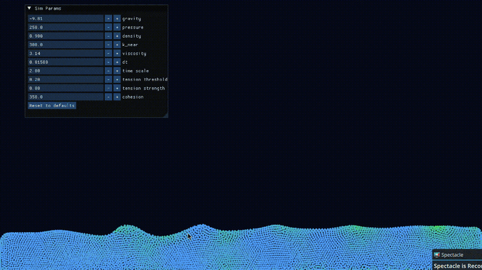

# Fluid Simulation

A real-time 2D fluid simulation written from scratch in C++17 and OpenGL 4.3,
based on **Smoothed Particle Hydrodynamics (SPH)**. The solver started as a
CPU implementation following Müller et al. [1] and has since moved entirely
onto the GPU: every stage of the physics - neighbour search, density,
forces, and integration - runs as compute shaders, with particle state living
in GPU buffers that are rendered directly, zero-copy.

<p align="center">
  
</p>

## Status

Running and interactive on integrated graphics.

**GPU pipeline.** Each physics step dispatches a chain of compute shaders:
a **counting-sort spatial grid** rebuild (count → scan → scatter) gives O(N)
neighbour queries, then fused density and force passes walk the 3×3 cell
neighbourhood once per particle. Positions and speeds are rendered straight
from the storage buffers - particle data never returns to the CPU.

**Physics.** Pressure follows the **Tait equation of state** (Becker &
Teschner [3], exponent 7) clamped to non-negative, so compression is punished
super-linearly while free surfaces feel no spurious attraction. A
Clavet-style **near-pressure** term [2] adds short-range repulsion, and an
Akinci-style **pairwise cohesion** force [4] holds detached blobs together
and pinches separating fluid into droplets. Müller color-field surface
tension [1] is also implemented (off by default). Gravity is on - the fluid
falls, pools, splashes, and settles.

**Integration and stability.** A **midpoint (RK2)** integrator evaluates the
full pipeline twice per step. The timestep is **adaptive**: a GPU reduction
finds the maximum particle speed and acceleration each frame, and two CFL
conditions [3, 6] shrink `dt` when the flow gets violent - stiff moments run in
brief slow-motion instead of exploding. A hard velocity cap in the
integration shader acts as a final firewall against NaN blow-ups.

**Interaction & tooling.** Drag with the mouse to push or pull the fluid,
pause and step/rewind through a GPU-resident history buffer, and tune the
physics live - gravity, pressure, rest density, near-pressure, viscosity,
tension, cohesion, timestep, and time scale - through a Dear ImGui panel.

Next up: PCISPH (predictive-corrective pressure solve [5]), which trades the
stiff equation of state for an iterative solver and larger timesteps.

## Performance

Measured on a 2013-era ultrabook - no discrete GPU:

| Component | Spec |
| --- | --- |
| CPU | Intel Core i7-4600U, 2 cores / 4 threads @ 2.1 GHz |
| GPU | Intel HD Graphics 4400 (Haswell GT2, integrated) |
| RAM | 8 GB |
| OS / driver | Fedora 44, Mesa 26.1.3 (OpenGL 4.6) |

| Particles | FPS |
| --- | --- |
| 5,000 | 60 (vsync-capped) |
| 10,000 | ~15 |

Each frame runs the full pipeline twice (RK2), so one frame = two grid
rebuilds, two density passes, and two force passes over every particle.

## Tech stack

- **C++17**
- **OpenGL 4.3** (core profile, compute shaders)
- **GLFW 3.4** - windowing and input (fetched automatically)
- **GLM 1.0.1** - vector math (fetched automatically)
- **Dear ImGui 1.91** - live parameter panel (fetched automatically)
- **GLAD** - OpenGL loader (pre-generated, bundled in `external/glad/`)
- **CMake** ≥ 3.20 with `FetchContent`

## Requirements

- A C++17 compiler (GCC or Clang)
- CMake ≥ 3.20
- A GPU + driver supporting **OpenGL 4.3 compute shaders**
- **X11 and/or Wayland dev headers** - GLFW builds both backends and selects
  one at runtime (`CMakeLists.txt`)

On Fedora, install everything with:

```bash
sudo dnf install mesa-libGL-devel \
    wayland-devel libxkbcommon-devel wayland-protocols-devel \
    libX11-devel libXrandr-devel libXinerama-devel libXcursor-devel libXi-devel
```

GLFW, GLM and Dear ImGui are downloaded and built automatically by CMake on
first configure, so no manual dependency installation is needed beyond the
system headers above.

## Building

The `run.sh` script provides build helpers. **Source it** to load the functions,
then call a build target:

```bash
source run.sh    # loads: debug, release, incremental-build (prints usage)

debug            # configure + build in Debug mode (defines DEBUG_MODE)
release          # configure + build in Release mode
incremental-build   # rebuild using the last configured mode
```

Each of `debug` / `release` removes any existing `build/` directory, recreates it,
configures with CMake, and builds in parallel.

### Manual build

```bash
cmake -S . -B build -DCMAKE_BUILD_TYPE=Release
cmake --build build --parallel
```

No `mkdir build` needed: `-S` points at the sources and `-B` names the build
directory, which CMake creates on its own. Both commands run from the
project root.

## Running

The compiled binary is placed in `bin/`:

```bash
./bin/fluid_simulation
```

**Controls:**

- **Left / right mouse** - pull/push the fluid to/from the center of the cursor within a given radius
- **Space** - pause and resume
- **Left / right arrow** - step back/forward while *paused*
- **R** - reset the scene
- **Esc** - quit

## Project structure

```
src/
  main.cc          - window/context setup, frame loop, adaptive-dt CFL clamp
  simulation.cc    - owns all GPU buffers + shaders, dispatches the pipeline
  renderer.cc      - draws particles straight from the simulation's buffers
  shader.cc        - RAII OpenGL shader-program wrapper (graphics + compute)
  debug_gui.cc     - RAII Dear ImGui wrapper for the live parameter panel
include/
  defs.hpp         - tunable constants + live-tunable SimParams
  simulation.hpp   - Simulation class interface
  history.hpp      - GPU-resident ring buffer of past states for rewind
  input.hpp        - keyboard/mouse polling helpers
  (+ headers for the .cc files above)
shaders/
  count.comp       - counting sort 1/3: histogram of particles per cell
  scan.comp        - counting sort 2/3: prefix sum over cell counts
  scatter.comp     - counting sort 3/3: write sorted particle indices
  density.comp     - density + near-density gather over the 3×3 neighbourhood
  force.comp       - pressure, near-pressure, viscosity, cohesion, tension
  midpoint.comp    - RK2 stage 1: build the half-step state
  step.comp        - RK2 stage 2: final advance, boundaries, velocity cap
  reduce_max.comp  - max speed/acceleration reduction for the adaptive dt
  particle.vert/.frag - point-sprite rendering, coloured by speed
  line.vert/.frag  - debug line/circle rendering
external/glad/     - bundled OpenGL loader
CMakeLists.txt     - top-level build (fetches GLFW/GLM/ImGui, builds GLAD)
run.sh             - build helper functions
```

## Physics overview

Each acceleration evaluation dispatches, in order:

1. **Grid rebuild** - counting sort over grid cells (histogram, prefix sum,
   scatter), giving each cell a contiguous slice of particle indices.
2. **Density** - poly6 kernel for regular density, a sharper kernel for
   near-density, gathered in one 3×3 cell walk.
3. **Forces** - one fused neighbour loop accumulates pressure and
   near-pressure (spiky-gradient kernels), viscosity (Laplacian kernel), and
   pairwise cohesion. Pressure comes from the Tait equation of state
   `p = k((ρ/ρ₀)⁷ − 1)`, clamped to ≥ 0; near-pressure `k_near · ρ_near` is
   purely repulsive.

The RK2 integrator runs this pipeline twice per step - once at the current
state, once at the half-step - then advances position from the midpoint
velocity and velocity from the midpoint acceleration, with reflective box
boundaries and a hard speed cap.

Between frames, a GPU reduction reads back the maximum speed and acceleration
magnitude, and the CFL conditions `dt ≤ λ·h/v_max` and `dt ≤ λ_f·√(h/a_max)`
pick the largest safe timestep, floored and ceilinged in `defs.hpp`. The
frame loop feeds physics steps from a fixed-timestep accumulator, so the
simulation stays deterministic through frame-rate spikes.

## References

- [1] M. Müller, D. Charypar, M. Gross - *Particle-Based Fluid Simulation
  for Interactive Applications*, SCA 2003.
  [PDF](https://matthias-research.github.io/pages/publications/sca03.pdf) -
  core SPH formulation: kernels, EOS pressure, viscosity, color-field
  surface tension.
- [2] S. Clavet, P. Beaudoin, P. Poulin - *Particle-based Viscoelastic Fluid
  Simulation*, SCA 2005.
  [PDF](http://www.ligum.umontreal.ca/Clavet-2005-PVFS/pvfs.pdf) -
  the near-density / near-pressure double-density relaxation.
- [3] M. Becker, M. Teschner - *Weakly Compressible SPH for Free Surface
  Flows*, SCA 2007.
  [PDF](https://cg.informatik.uni-freiburg.de/publications/2007_SCA_SPH.pdf) -
  Tait equation of state and the CFL timestep conditions.
- [4] N. Akinci, G. Akinci, M. Teschner - *Versatile Surface Tension and
  Adhesion for SPH Fluids*, SIGGRAPH Asia 2013.
  [PDF](https://cg.informatik.uni-freiburg.de/publications/2013_SIGGRAPHASIA_surfaceTensionAdhesion.pdf) -
  the pairwise cohesion force used for droplet formation.
- [5] B. Solenthaler, R. Pajarola - *Predictive-Corrective Incompressible
  SPH*, SIGGRAPH 2009.
  [PDF](https://www.ifi.uzh.ch/dam/jcr:ffffffff-daa5-74d6-0000-00005a4f5c99/pcisph.pdf) -
  PCISPH, the planned next solver.
- [6] M. Ihmsen, N. Akinci, M. Gissler, M. Teschner - *Boundary Handling and
  Adaptive Time-stepping for PCISPH*, VRIPHYS 2010.
  [PDF](https://cg.informatik.uni-freiburg.de/publications/2010_VRIPHYS_boundaryHandling.pdf) -
  the velocity + acceleration adaptive time-stepping criteria.
- [7] D. Koschier, J. Bender, B. Solenthaler, M. Teschner - *Smoothed
  Particle Hydrodynamics Techniques for the Physics Based Simulation of
  Fluids and Solids*, Eurographics Tutorial 2019.
  [PDF](https://sph-tutorial.physics-simulation.org/pdf/SPH_Tutorial.pdf) -
  survey of modern SPH: kernels, WCSPH, PCISPH, and beyond.

**Further reading** (consulted, not directly used):

- R. Bridson, M. Müller-Fischer - *Fluid Simulation*, SIGGRAPH 2007 course
  notes ([PDF](https://www.cs.ubc.ca/~rbridson/fluidsimulation/fluids_notes.pdf)) -
  grid-based (Eulerian) fluid simulation.
- D. Price - *Smoothed Particle Hydrodynamics and Magnetohydrodynamics*
  ([arXiv](https://arxiv.org/pdf/1110.3711)) - SPH theory from the
  astrophysics side.
- R. Klessen - *SPH lecture, Cardiff 2002*
  ([PDF](https://www.ita.uni-heidelberg.de/research/klessen/people/klessen/publications/presentations/2002-04-26-SPH-lecture-cardiff.pdf)) -
  introductory SPH lecture slides.
- *Fluid Simulation Tutorial*
  ([web](https://unusualinsights.github.io/fluid_tutorial/)) - hands-on
  particle fluid walkthrough.
- *SPH numerical simulation of peak pressure in near-field underwater
  explosion* ([AIP Advances](https://pubs.aip.org/aip/adv/article/13/9/095027/2913440)) -
  SPH applied to shock/pressure peaks.

## License

MIT - see [LICENSE](LICENSE).
