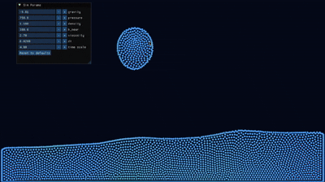

# Fluid Simulation

A real-time 2D fluid simulation written from scratch in C++17 and OpenGL, based on
**Smoothed Particle Hydrodynamics (SPH)** following Müller et al. 2003,
*"Particle-Based Fluid Simulation for Interactive Applications."*

<p align="center">
  
</p>

This is a learning project: particles are simulated on the CPU and rendered as
point sprites, with the physics built up incrementally — kernels, density and
pressure, pressure/viscosity forces, integration, and boundary handling.

## Status

Running and interactive. Particles are simulated with an SPH solve on predicted
positions; neighbour queries go through a spatial hash grid, so cost scales
roughly linearly with particle count rather than O(N²). The density and force
passes run in parallel via `std::execution::par`.

Gravity is on — the fluid falls, pools, and sloshes against the box walls. On
top of the standard SPH pressure, a Clavet-style **near-density / near-pressure**
term adds short-range repulsion that keeps particles from clumping. Integration
uses **midpoint (RK2)** instead of symplectic Euler: it stays stable at larger
timesteps and, by keeping the particle distribution even, keeps the neighbour
grid cheaper to query.

The update is driven by a fixed-timestep accumulator with a frame-delta clamp,
so the physics stays deterministic and stable through frame-rate spikes.
Particles are coloured by speed against a fixed reference (blue → red).

**Interaction & tooling:** drag with the mouse to push or pull the fluid, pause
and step/rewind through a recorded history buffer, and tune the physics live —
gravity, pressure, rest density, near-pressure, viscosity, timestep and time
scale — through an on-screen Dear ImGui panel.

## Tech stack

- **C++17**
- **OpenGL 4.3** (core profile)
- **GLFW 3.4** — windowing and input (fetched automatically)
- **GLM 1.0.1** — vector math (fetched automatically)
- **Dear ImGui 1.91** — live parameter panel (fetched automatically)
- **GLAD** — OpenGL loader (pre-generated, bundled in `external/glad/`)
- **CMake** ≥ 3.20 with `FetchContent`

## Requirements

- A C++17 compiler (GCC or Clang)
- CMake ≥ 3.20
- OpenGL development libraries
- **TBB** — backs `std::execution::par` (parallel algorithms); linked as `TBB::tbb`
- **X11 and/or Wayland dev headers** — GLFW builds both backends and selects one
  at runtime (`CMakeLists.txt`)

On Fedora, install everything with:

```bash
sudo dnf install tbb-devel mesa-libGL-devel \
    wayland-devel libxkbcommon-devel wayland-protocols-devel \
    libX11-devel libXrandr-devel libXinerama-devel libXcursor-devel libXi-devel
```

GLFW, GLM and Dear ImGui are downloaded and built automatically by CMake on first
configure, so no manual dependency installation is needed beyond the system
headers above.

## Building

The `run.sh` script provides build helpers. **Source it** to load the functions,
then call a build target:

```bash
source run.sh    # loads: debug, release, incremental-build (prints usage)

debug            # configure + build in Debug mode (defines DEBUG_MODE)
release          # configure + build in Release mode
incremental-build   # rebuild using the last configured mode
```

Each of `debug` / `release` removes any existing `build/` directory, recreates it,
configures with CMake, and builds in parallel.

### Manual build

```bash
cmake -S . -B build -DCMAKE_BUILD_TYPE=Release
cmake --build build --parallel
```

## Running

The compiled binary is placed in `bin/`:

```bash
./bin/fluid_simulation
```

**Controls:**

- **Left / right mouse** — pull / push the fluid near the cursor
- **Space** — pause and resume
- **Left / right arrow** — step back / forward while paused
- **R** — reset the scene
- **Esc** — quit

## Project structure

```
src/
  main.cc          — window/context setup, particle spawn, render loop
  defs.hpp         — tunable constants + live-tunable SimParams
  particle.hpp     — Particle struct (position, velocity, force)
  simulation.hpp   — Simulation class + inline SPH kernels (poly6, spiky, viscosity, near)
  simulation.cc    — density/near-density, forces, RK2 integration, boundary passes
  spacial_grid.hpp/.cc — spatial hash grid for O(N) neighbour queries
  renderer.hpp/.cc — owns VAO/VBO/shader, uploads positions and draws each frame
  shader.hpp/.cc   — RAII OpenGL shader-program wrapper
  debug_gui.hpp/.cc — RAII Dear ImGui wrapper for the live parameter panel
  history.hpp      — ring buffer of past states for pause/step/rewind
  input.hpp        — keyboard/mouse polling helpers
shaders/
  particle.vert    — point-sprite vertex shader
  particle.frag    — circular point fragment shader
external/glad/     — bundled OpenGL loader
CMakeLists.txt     — top-level build (fetches GLFW/GLM/ImGui, builds GLAD)
run.sh             — build helper functions
```

## Physics overview

Each acceleration evaluation runs two parallel passes over the particles:

1. **Density** — for every particle, sum kernel-weighted contributions from
   neighbours: a poly6 kernel for the regular density and a sharper near-density
   kernel. Pressure follows an equation of state `p = k(ρ − ρ₀)`; near-pressure
   is `k_near · ρ_near` and is purely repulsive.
2. **Forces** — accumulate pressure and near-pressure (spiky-gradient kernels)
   plus viscosity (viscosity-Laplacian kernel) in one fused loop; gravity is
   added as a constant acceleration.

A midpoint (RK2) integrator evaluates these accelerations twice per step — once
at the start and once at the half-step — then advances velocity and position
from the midpoint estimate, with reflective box boundaries.

Tunable parameters (kernel radius, mass, rest density, stiffness, near-pressure,
viscosity, gravity, timestep, time scale, domain bounds) live in `src/defs.hpp`;
the force knobs plus timestep and time scale are also editable live in the panel.

## License

MIT — see [LICENSE](LICENSE).
